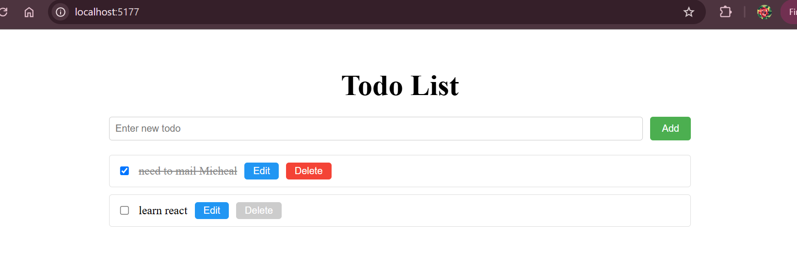

# React + Vite

This template provides a minimal setup to get React working in Vite with HMR and some ESLint rules.

Currently, two official plugins are available:

- [@vitejs/plugin-react](https://github.com/vitejs/vite-plugin-react/blob/main/packages/plugin-react/README.md) uses [Babel](https://babeljs.io/) for Fast Refresh
- [@vitejs/plugin-react-swc](https://github.com/vitejs/vite-plugin-react-swc) uses [SWC](https://swc.rs/) for Fast Refresh
# React-Todo-App

Learning Objectives
After completing this lab, learners will have demonstrated the ability to:

Use the useReducer and/or useImmerReducer hook to manage state with reducer functions.
Use useState in places where reducers are not appropriate or necessary.
Implement controlled forms and inputs.
Effectively decide where pieces of state should live.
Use conditional rendering and conditional styling to provide a positive, interactive user experience.
Create a complete React application from a set of desired functionality.

this is the output of the todolist.
